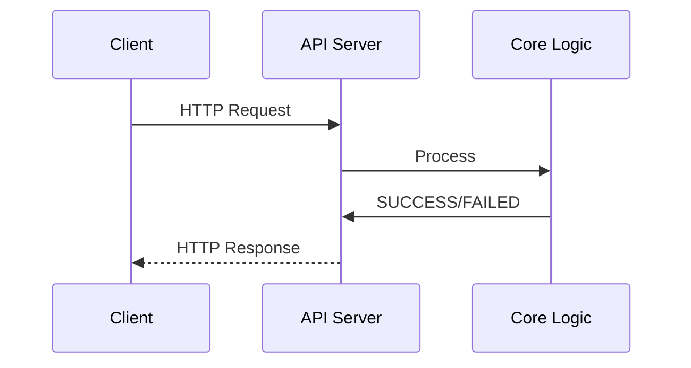
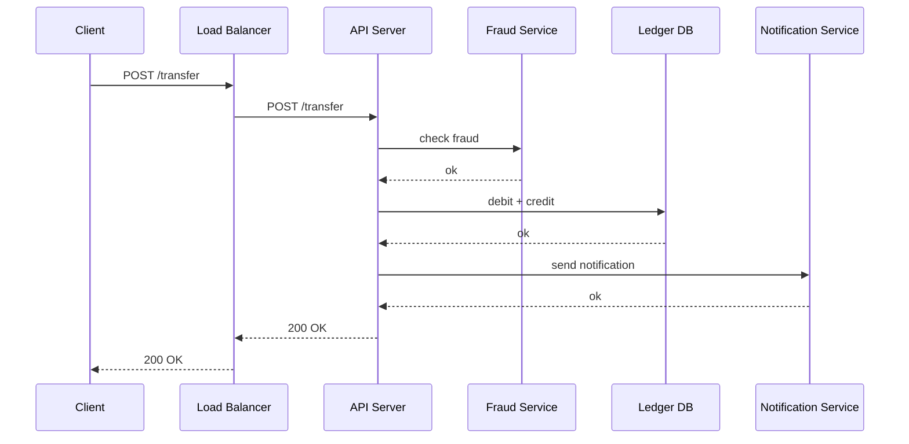
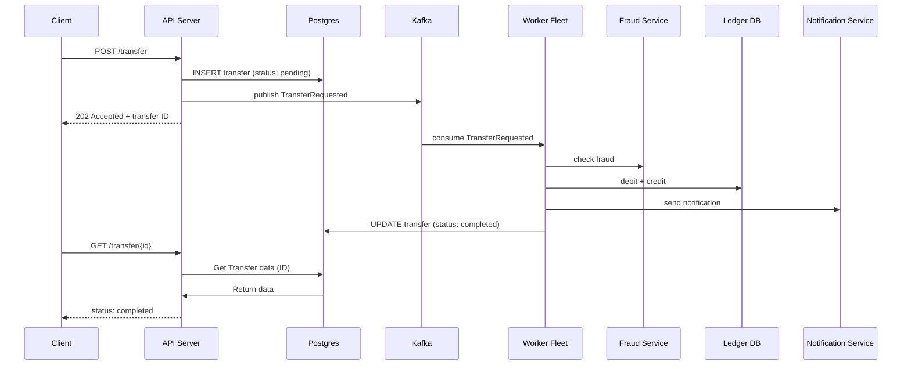
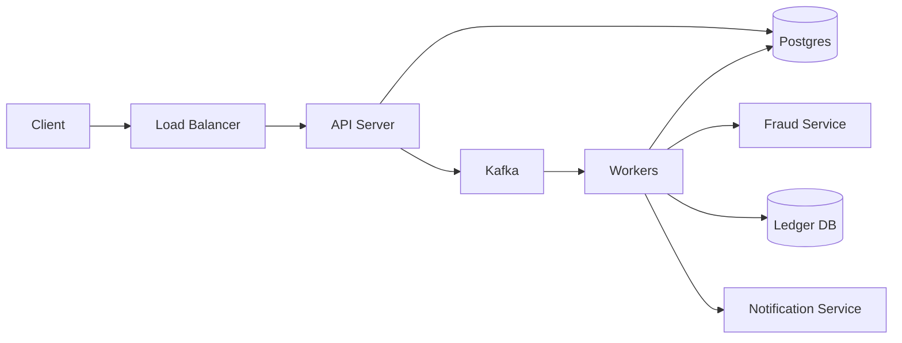

## Preface
---

There was a point in time in my study where I started dabbling with tools like Express JS and trying to learn about backend systems. I actually stumbled upon a question, in a small system, the most you would do in a single API call is just read or write a few rows in the DB. How about for big production systems like banks, Twitter (yes Twitter) and E commerce, do they rely on REST API? if yes then how did they do heavier stuff in that API, there's a strict timeout tho? But my banking app a lot of times can take more than 5 second to process? why didn't it timeout?

Yes, my knowledge was very scattered.........
- I knew that a typical REST API would need to give a response ASAP and I knew that you'll usually setup timeouts (I didn't know why back then)
- I knew a lot of processing would need to take a few second or even minutes/hours, if they're building APIs how are they handling it.
- What's this fuss about kafka and rabbitmq, events and message broker? The publisher and consumer diagram made sense but I don't understand how that's useful.


Well this was me 5 years ago and let's try to learn about this

## What is Asynchronous processing and why do I need to care about it
---

### Synchronous processing: 
- The caller hits an API and wait, the server processes the request, returns a response. While processing is ongoing, your request is on hold.
- Code lives within the HTTP request response lifecycle



### Asynchronous processing
- The caller doesn't wait. The API does the bare minimum, replies with an `acknowledgement`, and the actual work happens elsewhere.
- Code that gets executed outside of the request response lifecycle, deferred, retryable, non-blocking, is considered as a background job

### Why they matter

Synchronous processing means that the client will have to wait for a response to know processing has been completed/failed, Asynchronous on the other hand, replies to the client and basically says `got it`, we'll process it later.

Some things are synchronous by nature, and that's fine:
- Reading a profile
- Checking an account balance
- Validating a password

These are a single DB read, fast, and the caller can't move on without the answer. Making them async is just complexity for no reason.

Some things are heavy and nobody is waiting on them:
- Resizing an uploaded video
- Generating a statement PDF
- Sending 10,000 emails

Cram these into a single request and your API becomes slow. Keep in mind,

There are timeouts everywhere
- load balancers
- proxies
- The client itself
- Service to service timeouts

Now, don't confuse async with `slow batch job`. Async doesn't mean the work itself is slow or tolerant to failures, it means the caller isn't waiting on it. Some async work is time sensitive where it needs to be completed within a certain time window. A user places an order, a fraud check kicks off immediately, but the user isn't stuck staring at a spinner. The work needs to happen *now*, just not in their face.

So why not split it. The API does the light part inline (validate the request, save the intent, return with `202 accepted`) and hands the rest to a background worker to process later, whether that's in five milliseconds or five hours.

That's exactly why your banking app doesn't time out on a transfer. It gets a quick `202 accepted`, while the actual process of moving money happens in the background. As for the worker, the message to process the transfers are being relayed by a queue/brokers from the API server.

## Synchronous vs Asynchronous
---

Let's make this concrete with a simple bank transfer. A user hits `POST /transfer` with an amount and a destination account. To actually complete that transfer, the system needs to:

1. Run a fraud check
2. Move the money (debit one account, credit another)
3. Send a notification

### The synchronous version

Do all of that inside the request:



In Go, it'l roughly look something like this:

```go
func (h *Handler) Transfer(w http.ResponseWriter, r *http.Request) {
	var req TransferRequest
	json.NewDecoder(r.Body).Decode(&req)

	if err := h.fraud.Check(r.Context(), req); err != nil {
		util.BuildError(w, http.StatusForbidden, api.PaymentRejectedError)
		return
	}
	if err := h.ledger.Move(r.Context(), req); err != nil {
		util.BuildError(w, http.StatusInternalServerError, api.PaymentFailedError)
		return
	}
	if err := h.notify.Send(r.Context(), req); err != nil {
		// money has already moved but notification failed, now what?
		util.BuildError(w, http.StatusInternalServerError, api.PaymentFailedError)
		return
	}

	w.WriteHeader(http.StatusOK)
}
```

Clean, easy to reason about, and it'll work ...... until it doesn't. Here's how things can fail catastrophically:

- **Timeouts everywhere.** Your load balancer gives you 30s, the proxy before it maybe 60s, the client SDK maybe 10s. The fraud check alone can take a few seconds under load. Something in that chain gives up before the work completes.
- **The connection is held hostage.** Every in flight request holds a connection, a goroutine, memory. Enough slow transfers and your API server is busy doing bookkeeping instead of serving requests which in turn increases resource contention
- **One slow dependency stalls everything.** Fraud service degraded? Every transfer request now queues behind it, and so does every other request sharing the same resources.
- **Client retries are dangerous.** The LB times out at 30s but your server actually finished the transfer at 35s. The client sees a timeout, retries, and now you might have moved money twice (Hope you have idempotency handled :wink :wink).

For a profile read, none of this matters. For a transfer that chains three systems, it matters a lot. And we're only talking about 3 chains here. Real world bank transfer WILL have more.

### The asynchronous version

Same transfer, split differently. The API does the light part inline and hands the rest to a worker:



New components just appeared, so let's name them:

- **Message broker (Kafka)**: the middleman. The API drops a `TransferRequested` event in, workers pick it up. The API and the worker never talk to each other directly.
- **Topic**: a named channel inside the broker. `transfer.requested` is a topic. Publishers write to it, consumers read from it.
- **Worker (consumer)**: a process that subscribes to the topic and does the actual work. Same codebase as your API, usually, just running in a different mode. Need more throughput? Spawn more workers.

Same system, drawn as boxes instead of a timeline:



Two things worth noticing here. The API never touches fraud, ledger, or notifications systems, it only knows about Postgres and Kafka. And the workers are a fleet, not a process, they all subscribe to the same topic and share the load.

The API handler shrinks to the bare minimum:

```go
func (h *Handler) Transfer(w http.ResponseWriter, r *http.Request) {
	var req TransferRequest
	json.NewDecoder(r.Body).Decode(&req)

	// light part: validate, save intent, hand off
	id, err := h.store.SavePending(r.Context(), req)
	if err != nil {
		util.BuildError(w, http.StatusInternalServerError, api.PaymentFailedError)
		return
	}
	if err := h.publisher.Publish(r.Context(), "transfer.requested", id); err != nil {
		util.BuildError(w, http.StatusInternalServerError, api.PaymentFailedError)
		return
	}

	w.WriteHeader(http.StatusAccepted)
	json.NewEncoder(w).Encode(map[string]string{"transfer_id": id})
}
```

The worker does the heavy part, on its own time:

```go
func (w *Worker) handle(ctx context.Context, msg Message) error {
	transfer, err := w.store.Get(ctx, msg.TransferID)
	if err != nil {
		return err
	}

	if err := w.fraud.Check(ctx, transfer); err != nil {
		return w.store.MarkRejected(ctx, transfer.ID)
	}
	if err := w.ledger.Move(ctx, transfer); err != nil {
		return err // don't ack, retry later
	}
	w.notify.Send(ctx, transfer)

	return w.store.MarkCompleted(ctx, transfer.ID)
}
```

And since nobody is waiting on the response anymore, the client needs a way to find out what happened. The simplest answer is a status endpoint for polling results:

```go
func (h *Handler) GetTransfer(w http.ResponseWriter, r *http.Request) {
	transfer, err := h.store.Get(r.Context(), r.PathValue("id"))
	if err != nil {
		util.BuildError(w, http.StatusNotFound, api.PaymentNotFound)
		return
	}
	json.NewEncoder(w).Encode(transfer) // pending / completed / rejected
}
```

The client polls it, or you push the result via a notification, websocket, email depends on your product. The point is the answer moved from the response body to somewhere the client can look up later.

## What you signed up for
---

Async isn't free. You traded a timeout problem for a different set of problems:

### Duplicates will happen.
- At least once delivery means your worker can see the same event twice. Your processing must be idempotent, and this is non negotiable.
- Without idempotency, you'll risk the chance of doing a double transfer which is very very very bad. :ouch

### Everything is eventually consistent.
- The transfer is `pending` until it isn't. Your UI, your support team, and your users all need to be okay with that.
- Eventually consistent just means that any state update in the system won't immediately be visible to you, states will drift for a certain period until it gets synched again

### Failures need somewhere to go. 
- When the worker fails to process a message, retrying in place clogs the partition. You need a retry path and a DLQ. 
- I wrote a whole article on exactly this: [How resilient is your consumer?](/posts/resilient_consumer).

### Workers might need coordination.
- If you're not using kafka and splitting your topics into multiple partitions, there's a potential that multiple workers polling the same jobs will double process unless you think about locking. 
- Also wrote about that: [Distributed lock, a concurrency control mechanism](/posts/distributed_lock).

### More moving parts to operate.
- Broker, topics, consumer lag, worker fleet. Each one is another thing to tune and that can page you at 2am.

None of these are reasons to avoid async. They're the price of admission, and for anything heavy, it's a price worth paying.

## What we didn't discuss here
---

**Idempotency**
- We didn't discuss how important is idempotency and how it's non negotiable in such setup

**Inner workings of Kafka**
- We didn't go in depth on what is a (topic, partitions, brokers, consumer group)

**The dual write problem**
- In the async Go snippet above, I demonstrated writing to the database and then to the Kafka publisher.
- There's a problem called the dual write problem whereby, what happens when the write to the DB is successful but the write to kafka fails? That is a pretty nasty issue I'd say

**How does the worker capture operations state (success/failed)**
- The worker communicates with 3 downstream systems and the diagram is making assumptions that all 3 integrations are sync (yes, they could be async as well)
- How does the worker listens to the verdict of downstreams if they're also asyncrhonous? :wink :wink

I might write a part 2 of this topic to just elaborate on the gotchas when you introduced event driven components to your systems and cover the things we didn't in this article, that'd make a great follow up read. Inshallah
