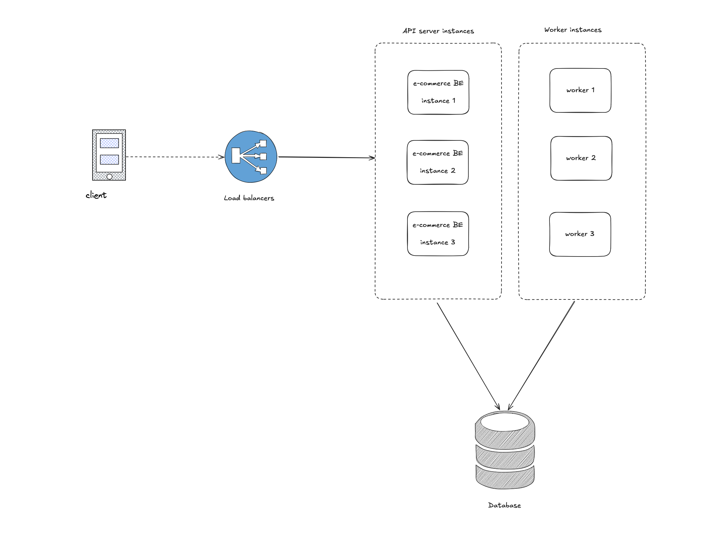
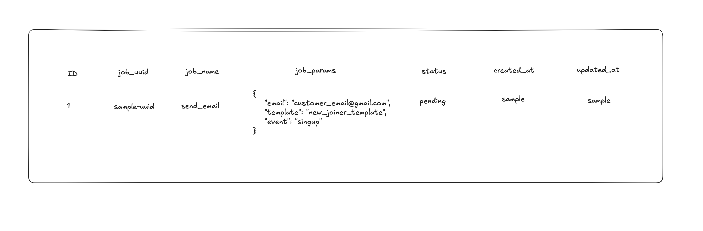
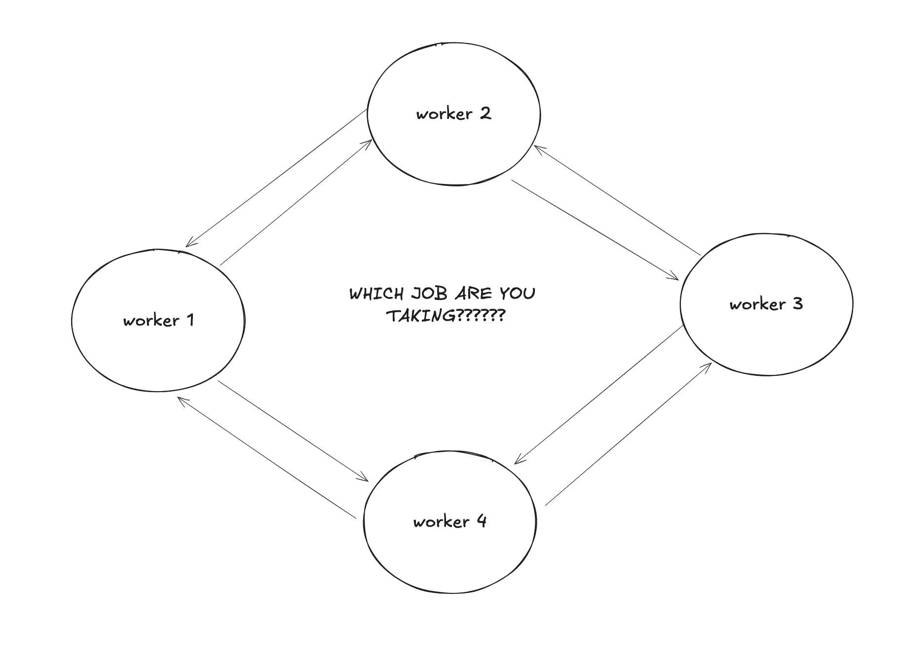
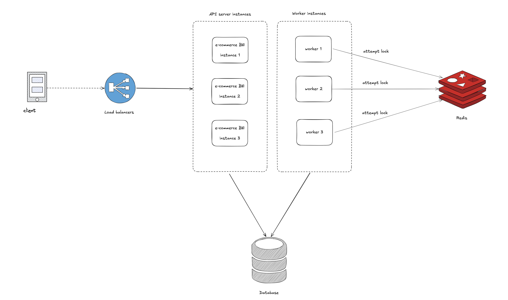
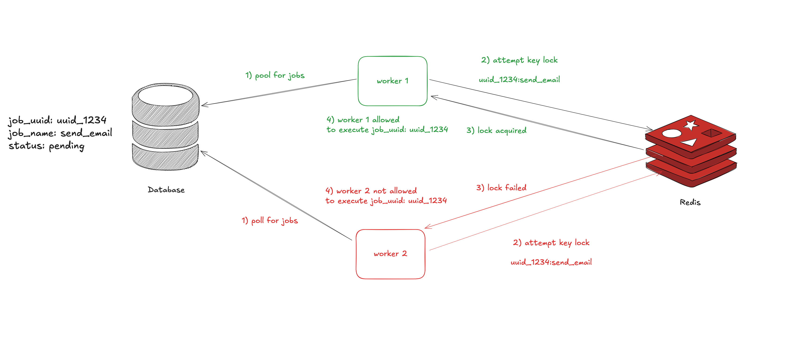

Here's my first article, here we go!!!

# What is locking?

From a computer science perspective, a lock, or a fancier name for it `mutex`, is one of the oldest and most fundamental synchronization primitives in computer science to solve a concurrency problems. It's commonly used to prevent a certain state from either being modified, accessed, or both by multiple threads of execution. There's numerous unique implementations to solve this problem, some behaves differently than others and some relies on different sets of dependencies from others.

## Distributed locking

In this article right here, we'll be looking at distributed locking and how it's useful in a backend and distributed systems environment. I think we already have a gist of that `locking` is, distributed locking however is a variation of what locking is, which applies in a distributed system environment, think of it as mutex but for synchronization between multiple physical nodes in a distributed systems environment


## The context that leads up to the problem

It's commonly known that in a backend systems, you'd have multiple nodes running the same applications, nodes can be a docker container, VM or kubernetes pods. You can read upon this article from ByteByteGo [Scale from zero to millions of users](https://bytebytego.com/courses/system-design-interview/scale-from-zero-to-millions-of-users).

What the article shared entails that, in a production grade backend systems, you'd have multiple instances of the same app running behind a load balancers that'll serve your traffic, this ensures that you have the resources necessary to serve all the request coming from the client.


On top of having multiple instance of API server, a typical backend setup at scales also involves multiple instances of a background worker as well

API servers - serves all the incoming HTTP API request (graphql, gRPC, REST, RPC)
Worker - serve asyncrhonous workload (event consumers, background jobs)



## The Problem

Here's the meat of the article, assuming you have multiple worker that'll query the database for `pending` jobs, the worker then picks up the job and executes it.



Worker background job logic
- polls the database for pending jobs
- query out the details of pending jobs
- executes the job

I'd argue that this logic works..... if you're building for fun, but not at scale (anything related to money, user data)

If you haven't caught on yet, the problem with this approach is that it's not scalable. If you have multiple workers, they'll all try to pick up the same job, leading to
- Duplicate executions
- Potential data inconsistency (without proper idempotency downstream)
- Wasted resources

With such setup, following the example, assuming your workers queried the database at the same time and saw the pending job, all the workers that managed to query that row will attempt to run the job, in this scenario specifically your customer might receive duplicate emails or notifications (Nothing serious). Let's assume your background job is doing something more critical, moving money? completing payments? checkouts? billing? that'll be pretty catastrophic don't you think?

All of this happens because your workers have no way getting a consensus on which jobs to run
- hey, who's picking up this job?
- can I pick this job?
- what job did you took?
- did you completed that job, or do you need me to retry?
- you completed it halfway before you crashed? now what?

## How would you solve this?

### My Initial line of thinking

My initial thought process of solving this is that, wouldn't it be great if I could have my worker tell the others what job I'm picking up? but then my worker would need to somehow `talk to each other`



That look like it could work but, it'll be super complicated
- My workers are now stateful as it needs to know how many workers are in the setup and poll for what job EACH OF THEM are taking
- I need a `communication mechanism` for my workers now?
- How easily can I spawn new workers and have my current fleet of workers aware of the new worker?

Let's be honest, doesn't look good right? It's not! let's take a step back shall we.

### How distributed lock solves this problem

This is where distributed lock came in handy

Instead of having our workers `talk to each other` and check what jobs are they taking so they themselves don't have to take that job.

Let's have our worker `lock` what job they're taking right now and `unlock` it when they're done, with this
- other workers know that the specific job has been `locked` and they should take a different one.
- my workers does not have to communicate directly with each other and get a consensus which job they can take
- my workers will be smart enough to know that when they attempt to take a lock and failed, `I'll just grab some other ones that haven't been locked`

To achieve this, we can use a distributed lock service like Redis (I've only done Redis so far, 16 Nov 2025).

### How your setup would look like with Redis in the mix

My approach to distributed lock requires Redis as an infrastructure dependencies



#### HLD for taking a lock would look like

This is a high level design for taking a lock using Redis.



Let's revisit the logic prior to Distributed lock

Worker background job logic
- polls the database for pending jobs
- query out the details of pending jobs
- executes the job

Worker background job logic with Distributed Lock
- polls the database for pending jobs
- query out the details of pending jobs
- attempt to take a lock (design your lock key)
- lock attempt successful
- executes the job
- release lock when succeed

**Lock key**
Lock keys should uniquely identify the work. For the example above `sample-uuid#send_email`. This prevents Worker 1 from locking 'send_email' while Worker 2 processes a different 'send_email' job with a different UUID.

Keep in mind
- The lock timeout is critical: if a worker crashes while holding a lock, the timeout ensures other workers can eventually retry the job. Set this timeout longer than your expected job duration. For long-running jobs, you'll need to implement lock renewal (not covered here).
- This approach assumes jobs can be safely retried if a worker crashes mid-execution. For critical operations (payments), you need idempotency keys in your job processing logic, not just distributed locks. You also need to handle lock renewal for jobs that run longer than the timeout.

### How does `locking` works in Redis?

Good question, Redis offers sets of APIs that you can leverage to achieve this `locking` mechanism.

We'll be using Go for the sample code

The `Lock()` function uses Redis's SETNX (SET if Not eXists) with a timeout. This provides atomic lock acquisition with automatic expiration

`SETNX` is basically SET IF NOT EXISTS, this function by redis takes in a `key` and `value` as parameters, if Redis returns 1 it means that the lock was successfully acquired, 0 if failed. [reference](https://redis.io/docs/latest/commands/setnx/)
```go
func (l *Locker) Lock(ctx context.Context, timeout time.Duration) error {
	success, err := l.client.SetNX(ctx, l.key, l.value, timeout).Result()
	if err != nil {
		return err
	}
	if !success {
		return fmt.Errorf("lock for key %s is already held", l.key)
	}
	return nil
}
```

The `Unlock()` releases the lock if the caller of the function is the one that actually has the lock, it checks if the value matches the one stored in Redis before deleting the key.

```go
func (l *Locker) Unlock(ctx context.Context) error {
	script := "if redis.call('get', KEYS[1]) == ARGV[1] then return redis.call('del', KEYS[1]) else return 0 end"
	result, err := l.client.Eval(ctx, script, []string{l.key}, l.value).Result()
	if err != nil {
		return err
	}
	if result == int64(0) {
		return fmt.Errorf("unlock failed, either lock expired or you're not the lock holder for key %s", l.key)
	}
	return nil
}
// The Lua script ensures atomicity, it checks ownership before deleting. This prevents Worker A from accidentally releasing Worker B's lock if Worker A's lock expired and Worker B acquired it.
```

- Here's a minimal library in Go to start using distributed locking with Redis [github](https://github.com/muazwzxv/dist-lock)
- Library was extracted out from an open source project [blnk project](https://github.com/blnkfinance/blnk)
- If you want to read more about distributed lock, here's a great material from Matin Klepman, the author of Designing Data Intensive Applications [link](https://martin.kleppmann.com/2016/02/08/how-to-do-distributed-locking.html)

Thank you for reading
