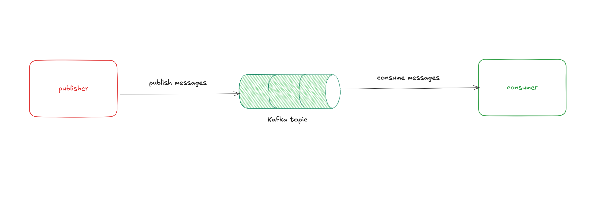

# Intro 

In today's modern age of building software at scale. It's no alien that we'll be facing situations where request response lifecycle such as REST, gRPC, GraphQL, etc might not be enough, there's certain scenarios where the logic we want to execute might take more than 7 seconds or even longer, sometimes we might want a delayed executions and some other times we want to notify multiple downstream systems. 

##  Kafka

Kafka is a distributed streaming platform that allows for the production, consumption, and processing of large volumes of data in real-time. It provides a fault-tolerant and scalable solution for building distributed systems that require high throughput and low latency (AI generated)

Sounds cool right? It is, from experience we've been using Kafka for 
- asyncrhonous processing
- batch jobs processing
- streaming messages to multiple systems (payments, onboarding) to update domain's lifecycle

It's our silver bullet for building event driven systems

## The anatomy of a kafka driven systems

In it's simplest form, these are the components

### Publishers 
---

The publisher's role is to the component that'll push a message to kafka specifically to a kafka topic. The mental model here would be that

Assuming you have a publisher setup in the account microservice, when there's an event for an account for example account getting banned or closed, the publisher will push a message to the kafka topic to broadcast to all listeners that's interested in the event.

### Kafka Topics
---

Think of a Kafka topic as a named channel or category where messages live. When a publisher sends a message, it goes to a specific topic, and any consumer interested in that topic can read from it.

Following our account example, you might have a topic called `account-events`. When the account service publishes an "account banned" message, it goes into this topic. Any downstream service (payments, notifications, analytics) that subscribes to `account-events` will receive that message.

The beauty here is that multiple consumers can read from the same topic independently - each service processes the message at its own pace without affecting others. The messages also persist in the topic for a configured time period, so even if a consumer is temporarily down, it can catch up later.I

### Consumers
---

The consumer's role that it'll be the component that'll listen to these messages from the kafka topic and behave according, following the example in publishers section, 

let's assume a consumer specifically cares about if an account is banned, it'll consume the message and run whatever logic necessary to process the account ban event.
