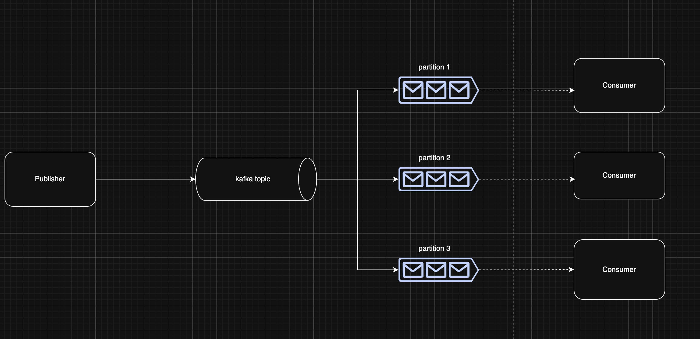
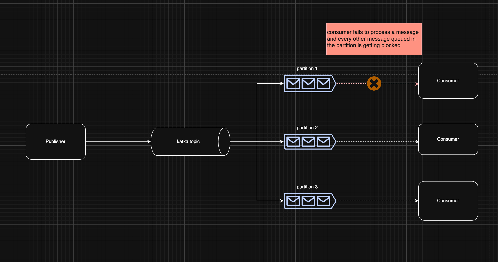
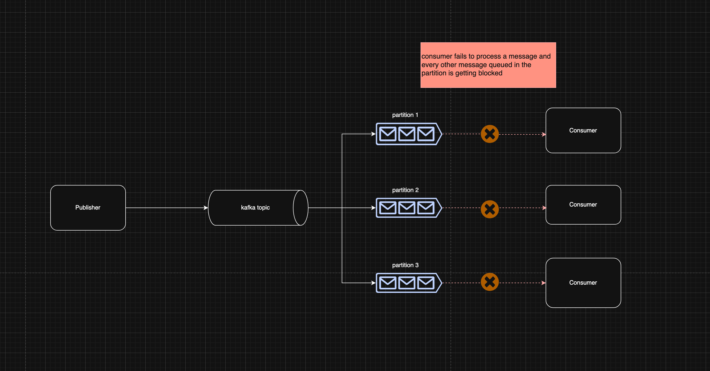
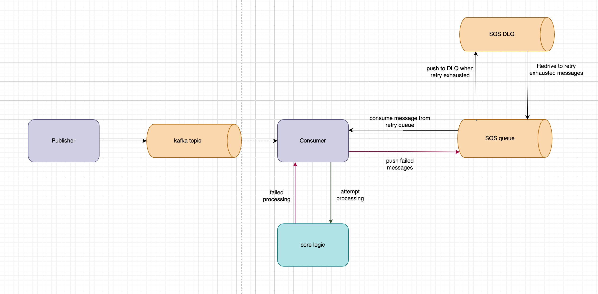

## The Problem
---

In modern systems, you'll find it pretty common where we'd have asynchronous components. Mechanism such as `queues` and `message broker` are an important piece to building a resilient and scalable systems. Regardless of a monolithic backend or a microservices architecture, you'll see this mechanism being used for asynchronous processing, event driven architecture and etc.

Despite all the advantages of this architecture decision. It comes with some tricky nuances when it comes to handling errors that are both transient and non transient. Which begs the question

- How resilient is your consumers? 
- How well does your consumer operates in a degraded state?
- Can your consumers keep up under heavy load, do you have mechanism to shed some of the loads?
- Do you have enough visibility to any poison pills your consumers attempted to process?
- How well can your system recovers from lost messages? 

For this topic, we'll specifically cover the usecases with Kafka as the message broker.


## Production system setup with kafka
---

To illustrate how a kafka is being used in systems. Let's start with a diagram



**Publishers**
- Kafka publishers fire events into a topic. They're the upstream producers, whenever something happens in your system (a user signed up, a payment was processed, an order was fulfilled), the publisher emits that event to the relevant topic so downstream systems can listen and react to it.

**Consumers**
- Kafka consumers subscribe to topics and process whatever events come through. A consumer pulls messages off the queue, does something useful with them (updates a database, triggers a notification, runs business logic), and then moves on to the next message. In a typical setup, you might have multiple consumer instances all reading from the same topic in parallel.

**Topics**
- A topic is a named channel. Publishers drop messages in here, consumers pick them up from here. What makes Kafka different from a regular queue is that messages in a topic are retained for a configurable period (message durability), so consumers can re-read old messages if needed, and multiple independent consumers can subscribe to the same topic without interfering with each other (consumer groups)

**Partitions**
- Under the hood, every topic is split into partitions. Partitions are the secret sauce behind Kafka's parallelism, each partition can be consumed by a different consumer in your consumer group simultaneously. Within a single partition, messages are strictly ordered and immutable. This is powerful, but it comes with a catch. Assuming a consumer gets stuck on one message in a partition, everything behind that message waits its turn. That clawback is what we'll get into next.


## A production system handling thousands - millions messages per day
---

One of the benefit of kafka is that you can scale up your partitions alongside the number of consumers you have to increase the message processing throughput (partitions created can't be scaled down, ideal starting point for partition is 3)

Let's imagine if one of the consumer's downstream dependency faces some issue (transient failures, permanent failures)



Doesn't look pretty right. What the diagram is trying to illustrate is that assuming that one consumer is facing an issue processing messages in one of the partition queue, mind you that `kafka offers ordered message guarantee within partition level`, which in this case would mean that unless the consumer ack() the message, the partition will forever be clogged as messages being queued in that partition won't be processed due to being held back by this one message and your consumer lag will shoot through the roof.

Let's explore the side effect of that.
- Reduced throughput (one clogged partitions meaning you're left with only 2 good partition and consumers)
- Messages that were queued within the clogged partition won't be processed unless someone intervenes or system recovers (assuming transient failures, network blip, rate limit, load shed)

Well that does look nasty, but that's not really the worst thing that could happen



well ........ gg, now what?


## The Naive Options (and why they suck)
---

Well, from the previous chapter. We explored one of the failure modes that could catastrophically halt your system

In such situation you're left with several `naive` options


### Best effort retry and move on
---

Assuming the problem was intermittent, some dependency has degraded that's impacting the consumer. We could setup a best effort retry with a simple backoff (retry n number of times and just move on if that fails). This is better than nothing but you're now left with a partially failed transactions and a broken state (assuming your system is eventually consistent).

To be fair this is better than no retry mechanism at all and a lot of system start with this approach to balance speed of development and system reliability. Assuming you're only observing some intermittent failures and only 1% of message retries are being exhausted and dropped, it's probably fine to just manually intervene to patch the broken state or republish the drop message. 

But what happens when one of your dependencies has degraded and was rejecting all new connections for 2 hours straight. 100% of messages were dropped for that 2 hours. Good luck to oncall engineer that has to figure out how to reconcile those messages


### Halt and retry in place
---

This option is as explained in earlier discussions. When a failure happens we let the consumer crash. What would happen is that the consumer comes back up, re-poll the same message on the next cycle and fall again. As you can imagine, this is a vicious loop

```
poll -> fail -> don't ack() -> poll -> fail ....
```

However, this method does ensure that all messages gets processed ...... even poison messages (though it might crash the consumer, yikes)

The downside is clear here.
- Consumer lags increases
- Any transactions and any user journey will get stuck
- It'll be worse for poison messages (no way to self recover)

Both options don't look so good right? Best effort is the most viable here if you're considering the two options here


## The Retry Pattern: Decouple and Defer
---

So what do we do about it? At work, we had this exact problem. The moment we realized our consumer was failing synchronously that the Kafka partition was blocked while we retried in place, we knew we had to change the design.

The core premise of the solution is to **stop handling failure inside the consumer.** The moment you treat a failed message as a problem the consumer needs to solve right now, you're introducing a mode in your consumer where it needs to handle the failure at the expense of throughput. Instead, park it somewhere else, commit the offset like nothing happened, and move on.

That's the `decouple and defer` principle. The failed message gets handed off to a separate system whose entire job is handling retries. Kafka stays clean and fast it's the hot path for happy path processing. The retry system is the warm path where problem messages go to be tried again later.

### Enter SQS
---

At work, we settled on SQS as that warm path. Two reasons made it the right fit:

**Visibility timeout.** 
- When a message lands in SQS, you can hide it for N number of seconds from other SQS consumers in your fleet. After those N seconds, it reappears automatically, no cron jobs, no polling logic, no custom retry scheduler to build and maintain. SQS handles the timing for you.

**Redrive policy.** 
- This was the killer feature. You configure SQS to say `if a message is received X times and still not deleted, move it here.` That `here` is your dead letter queue. We didn't have to write a single line of code to get automatic DLQ behavior. it's built into the SQS queue configuration. It's considered best practice with SQS to also provision an SQS DLQ alongside your main queue. 

The mental model we use internally is three tiers:
- **Kafka** = hot path (real-time, happy path, clean)
- **SQS** = warm path (retries, managed, waiting)
- **DLQ** = cold path (manual intervention, something has gone horribly wrong)


### The Key Behavior
---

There's one rule that makes this all work, `always commit the Kafka offset, even when you fail.`

This was the biggest mental shift for the team. When a message fails, you publish it to SQS and then commit the offset anyway. You're not ignoring the failure, you're deferring it. The message isn't lost. It's sitting in SQS, waiting to be retried. Kafka moves on, your consumer stays healthy, and your partition never clogs.


## Architecture Walkthrough
---

Voilà



Let's walk through the flow step by step:

### **Happy Path:**
1. Your Kafka consumer polls a batch of messages from the topic
2. For each message, it attempts to process (calls downstream APIs, updates databases, etc)
3. On success, commit the Kafka offset `ack()` and move on to the next message

### **When Things Go Wrong:**
4. On failure, instead of retrying in place, the consumer immediately publishes the failed message to your SQS retry queue. What you publish matters. You need to include the Kafka message body, but also consider adding metadata like the original topic, partition, offset, failure reason and the trace ID. This information will be crucial if the message ever reaches DLQ.
5. **Regardless of failure** commit the Kafka offset anyway. This is the mental shift. Remember, you're not suppressing the errors, you're deferring it thus offloading the responsibility to the retry queue to handle errors and retries.
6. Your retry worker (could be a Lambda, a separate runtime, or even the same consumer reading from SQS) polls the retry queue
7. It attempts to process the message from SQS
8. On success: delete the message from SQS indicating a successful retry
9. On failure: don't delete it. SQS's visibility timeout makes it reappear after N number of seconds for another attempt
10. After `maxReceiveCount` failed attempts: SQS automatically moves it to the DLQ (french kiss)

### **The Human Loop:**
11. (CloudWatch, datadog, grafana) alarm fires because DLQ has messages
12. Engineer intervenes, looks at the message payload, checks the error context, identifies the root cause (bug, config issue, external dependency problem)
13. Fixes the issue
14. Redrives messages from DLQ back to the main retry queue (or processes them manually if it's a one-off)

***To keep in mind***
- SQS has a 256KB message size limit. If your Kafka messages are large, you might need to store the payload in S3 and just put a pointer in SQS.


## Retry Logic & Thresholds
---

So how do you actually configure this thing? Here are the parameters that matters


### maxReceiveCount
---

This represents how many times SQS will let a message be received prior to exhausting it retries and moving the message to the DLQ

We initially started with 3 (seemed reasonable). But what we've observed is that during our disaster recovery practice where we were testing the swtichover to DR site (from ap-southeast-1 to ap-southeast-5). The increased number of latency had caused the retry to be exhaused fairly quick (mind you we didn't set an ideal visibility timeout at that time). Hence retries were coming in with very small window of backoff.  

We ultimately increased it to 10 which gave us more runway for retries, but your mileage may vary based on your downstream's availability and SLA.


### Visibility Timeout and Backoff
---

The visibility timeout controls how long a message stays hidden from consumers after being received. 

Fixed timeouts are very simple but can hammer a recovering system. Exponential backoff is gentler, first retry after 30s, next after 60s, then 120s, etc. This is configurable but the main goal here is to give downstream systems time to recover as supposed to retrying at an exact backoff period (too bad we don't have this with SQS yet).


### The DLQ as Your Safety Net
---

Assumeing `maxReceiveCount` has reached and retries have been exhausted, SQS automatically moves the message to your configured DLQ. This is where an engineer would need to intervene and look into the queue.

Ideally, setup your observability monitors to have visibility on the DLQ's depth. Depending on the serverity of the system's journey you can configure your threshold to paged oncall engineer, up to the team. But the goal here is to have awareness when messages are being sent to the DLQ


## Trade-offs & Gotchas
---

I know I'm advocating for this solutions. However, nothing comes for free. Here's something to consider and keep in mind


### Bye bye message ordering
---

Kafka guarantees ordering within a partition. Once you route messages through SQS, that guarantee is basically gone. Messages may be retried and re-processed out of order.

Can you live with it. You'll have to assess your usecase and your business domain to decide wheather this is something your system can tolerate. In system where strict message ordering is important and non negotiable. This pattern is probably not for you.


### Duplicates Will Definitely Happen
---

SQS Standard queues are at least once delivery semantic. You **will** be receiving duplicate messages. Your processing logic must be idempotent.

If you ask me, regardless of having a good retry mechanism for your consumers or not. Idempotent is a non negotiable aspect of a system if you're dealing with transactional based systems. 

But for this retry logic to make sense, your code implementation have to idempotent and safe to retry (non negotiable).


### Cost is Cheap, Complexity Isn't
---

SQS itself is dirt cheap, first million requests are free, then $0.40 per million. The real cost here is operational cost. 

Now you need to maintain
- The main kafka topic and consumer
- 2 additional queue to monitor (sqs retry queue, sqs DLQ queue), 
- A retry worker to maintain, 
- An observability monitoring for DLQ, and 
- Idempotency logic ensure at most once side effects. 

It's worth it for the resiliency, but don't pretend it's zero overhead.

Internally what we've done is that the platform team have come up with a package that scaffolds the kafka consumer and the SQS retry consumer so the service level code does not have to worry about writing a new consumer. The package handles the service level codes to integrate and spawn these new retry consumers alongside the kafka consumers

## What's Still Missing: True Backpressure
---

The retry pattern we built handles decoupling and message durability well, but what it doesn't solve yet, is a critical problem **protecting downstream from overload**.

Here's the uncomfortable truth, assuming 10,000 messages fail and land in SQS, the system now have 10,000 retry attempts queued up. With a `maxReceiveCount` of 10, that's potentially 100,000 requests that will eventually hit your downstream system. The visibility timeout spaces these retries over time, but it doesn't reduce the total volume. When your downstream recovers, the retry storm begins. With no real way of throttling your consumers, you're not really giving space for your downstream dependency to gracefully recovers

This is deferred pressure, not true backpressure.

For production systems handling serious load, we need proper mechanisms that actually throttles or pause processing when downstream struggles. 

Here are three approaches worth considering

**Circuit Breaker** 
- When failure rates exceed a threshold, the breaker trips and stops all processing temporarily. After a cooldown period, it lets a trickle of requests through to test if downstream has recovered. This prevents cascading failures and gives systems room to breathe.

**Consumer Pause**
- Dynamically pause Kafka polling when your retry queue depth exceeds a threshold. Stop consuming new messages until the backlog clears and downstream stabilizes.

**Rate Limiter**
- Hard cap the number of requests per second to downstream, regardless of how many messages are waiting. Let messages naturally back up in Kafka rather than overwhelming a struggling dependency (potentially hurting system's throughput)

The goal isn't just to retry it, but to match your consumer's throughput to what downstream can actually handle. That's true backpressure, and it's an enhancement we still need to build.

## Closing
---

So what did we build?

A consumer that doesn't lose messages and doesn't block on failure. Three tiers working together
- Kafka for the hot path
- SQS for the warm retry path
- DLQ for the cold path that needs human intervention

The mindset shift needed here is that
- commit the offset early, defer the retry to a system built for it.

What this gave us at work was confidence. No more 2am panic about lost messages. No more watching consumer lag climb while a downstream API sputters. Clear escalation paths, retry queue growing? That's fine, it's working. DLQ has messages? Someone needs to look.

The main take away is that we should design system with the potential failure modes in mind, not just the happy path. Your consumers **will** fail, it's not a question of if, but when. Build the retry path into your architecture from day one, not as an afterthought you slap on when things break.

The real measure of a system isn't how it performs when everything works. It's how it degrades when things break and how well does it operates in a degraded state.

Look at your own consumers today. What happens when a message fails? If the answer makes you uncomfortable, consider the SQS retry pattern.
